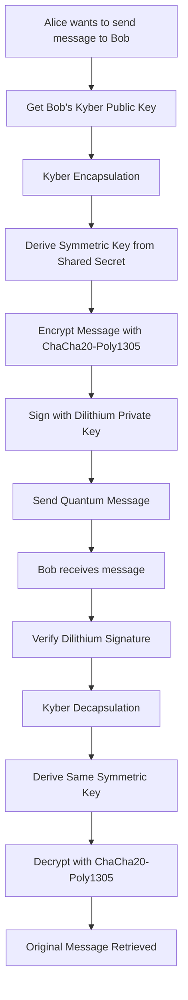

# Quantum-Resistant E2E Encrypted Messaging (POC)

A proof-of-concept React Native Expo application implementing quantum-resistant end-to-end encryption using NIST-standardized post-quantum cryptography algorithms.


## Overview

This application implements a hybrid quantum-resistant cryptographic system that combines:

- **CRYSTALS-Kyber** (ML-KEM) for quantum-resistant key encapsulation
- **CRYSTALS-Dilithium** (ML-DSA) for quantum-resistant digital signatures
- **ChaCha20-Poly1305** for symmetric authenticated encryption
- **HKDF** for secure key derivation

This implementation ensures that encrypted communications remain secure even against future quantum computer attacks, addressing the growing concern of "harvest now, decrypt later" attacks.

## Architecture

### Cryptographic Flow



### Key Components

1.  **Native Quantum Crypto Module** (iOS/Android)

    - Implements CRYSTALS-Kyber and CRYSTALS-Dilithium algorithms
    - Uses liboqs (Open Quantum Safe) library
    - Provides native performance for cryptographic operations

2.  **Quantum Secure Message Service** (JavaScript/TypeScript)

    - High-level API for encryption/decryption operations
    - Key management and storage
    - Message formatting and protocol handling

## Technology Stack

### Core Technologies

- **React Native** with **Expo SDK 52**
- **TypeScript** for type safety
- **Native iOS/Android modules** for quantum cryptography

### Cryptographic Libraries

- **liboqs** - Open Quantum Safe library for post-quantum algorithms
- **TweetNaCl** - For ChaCha20-Poly1305 symmetric encryption
- **Expo Crypto** - For key derivation and hashing

## Installation & Setup

### Prerequisites

- Node.js 18+ and npm/yarn
- Expo CLI (`npm install -g @expo/cli`)
- iOS Simulator (macOS) or Android Studio
- Xcode (for iOS development)

### 1. Clone and Install Project/Dependencies ([liboqs README.md](https://github.com/open-quantum-safe/liboqs/blob/main/README.md))

```bash
git clone https://github.com/gideon-amp/e2e-poc.git
cd e2e-poc
npm install

# Clone and build liboqs
cd ~/
git clone https://github.com/open-quantum-safe/liboqs.git
cd ~/iboqs-main
mkdir build && cd build
cmake -GNinja ..
ninja


```

### 4. Setup Native Quantum Crypto Module

#### iOS Setup

1.  Verify LIBOQS_DIR path in `modules/quantum-crypto/build.sh`
2.  Run `npm run build:liboqs` to generate necessary `modules/quantum-crypto/ios/liboqs.xcframework` folder

### 5. Run the Application

```bash
# Start the development server
npx expo start

# Run on iOS
npx expo run:ios

# Run on Android
npx expo run:android

```

## Features

### Core Functionality

- Quantum-resistant key generation (Kyber + Dilithium)
- End-to-end encrypted messaging with post-quantum security
- Digital signature verification for message authenticity
- Secure key storage using device secure enclave
- Cross-user messaging with key exchange
- Message integrity protection against tampering

### Security Features

- Forward secrecy - each message uses a fresh shared secret
- Authentication - digital signatures prevent impersonation
- Non-repudiation - cryptographic proof of message origin
- Quantum resistance - secure against Shor's algorithm
- Key verification - fingerprint-based contact verification

### Testing & Debugging

- Comprehensive testing suite for cryptographic operations
- Debug logging for encryption/decryption flow
- Key generation testing and validation
- Signature verification testing
- End-to-end cycle testing

## Security Implementation Details

### Key Sizes (NIST Level 3 Security)

- **Kyber-768 Public Key**: 1,184 bytes
- **Kyber-768 Private Key**: 2,400 bytes
- **Dilithium-3 Public Key**: 1,952 bytes
- **Dilithium-3 Private Key**: 4,000 bytes

### Message Format

```typescript
interface QuantumMessage {
  id: string; // Unique message identifier
  senderId: string; // Sender user ID
  recipientId: string; // Recipient user ID
  kyberCiphertext: string; // Kyber encapsulated key (base64)
  encryptedPayload: string; // ChaCha20-Poly1305 encrypted message
  nonce: string; // Encryption nonce (base64)
  signature: string; // Dilithium signature (base64)
  timestamp: number; // Message creation time
  version: string; // Protocol version
}
```

### Encryption Process

1.  **Key Encapsulation**: Use recipient's Kyber public key to generate shared secret
2.  **Key Derivation**: HKDF-like derivation from shared secret + salt
3.  **Symmetric Encryption**: ChaCha20-Poly1305 with derived key
4.  **Digital Signature**: Dilithium signature over message components
5.  **Message Assembly**: Combine all components into quantum message

### Decryption Process

1.  **Signature Verification**: Verify Dilithium signature with sender's public key
2.  **Key Decapsulation**: Use recipient's Kyber private key to recover shared secret
3.  **Key Derivation**: Recreate symmetric key using same derivation process
4.  **Symmetric Decryption**: ChaCha20-Poly1305 decryption
5.  **Message Recovery**: Extract original plaintext message

## 📖 Usage Examples

### Basic Message Encryption

```typescript
import { QuantumSecureMessageService } from "./services/QuantumSecureMessageService";

// Initialize service for Alice
const aliceService = new QuantumSecureMessageService("alice_123");
await aliceService.initializeKeys();

// Get Bob's contact information
const bobContact = {
  id: "bob_456",
  name: "Bob",
  kyberPublicKey: "bob_kyber_public_key_base64",
  dilithiumPublicKey: "bob_dilithium_public_key_base64",
  verified: true,
};

// Encrypt message
const encryptedMessage = await aliceService.encryptMessage(
  "Hello Bob! This message is quantum-secure.",
  bobContact
);

// Send encryptedMessage to Bob...
```

### Message Decryption

```typescript
// Initialize service for Bob
const bobService = new QuantumSecureMessageService("bob_456");
await bobService.initializeKeys();

// Get Alice's contact information
const aliceContact = {
  id: "alice_123",
  name: "Alice",
  kyberPublicKey: "alice_kyber_public_key_base64",
  dilithiumPublicKey: "alice_dilithium_public_key_base64",
  verified: true,
};

// Decrypt received message
const decryptedMessage = await bobService.decryptMessage(
  encryptedMessage,
  aliceContact
);

console.log("Decrypted message:", decryptedMessage);
```

### Key Export and Verification

```typescript
// Export public keys for sharing
const publicKeys = await aliceService.exportPublicKeys();
console.log("Alice's fingerprint:", publicKeys.fingerprint);

// Verify contact's key fingerprint
const isValid = await bobService.verifyContactFingerprint(
  aliceContact,
  "EXPECTED_FINGERPRINT"
);
```

## 🔧 Configuration

### Security Configuration

```typescript
// Key derivation settings
const DERIVATION_SALT = "quantum-resistant-messaging-salt-v1";
const KEY_INFO = "symmetric-encryption-key";

// Supported algorithms
const KYBER_VARIANT = "kyber-768"; // NIST Level 3
const DILITHIUM_VARIANT = "dilithium-3"; // NIST Level 3

// Message protocol version
const PROTOCOL_VERSION = "1.0.0";
```

### Storage Configuration

```typescript
// Secure storage keys
const PRIVATE_KEY_STORAGE = `quantum_private_keys_${userId}`;
const PUBLIC_KEY_STORAGE = `quantum_public_keys_${userId}`;
const CONTACTS_STORAGE = "secure_contacts";
```

### Known Limitations

- **Key Size**: Large post-quantum keys require more storage
- **Performance**: PQC operations are slower than classical crypto
- **Standardization**: Algorithms may evolve as standards mature
- **Interoperability**: Limited compatibility with classical systems

## Roadmap

### Phase 1 (Completed)

- [x] Basic quantum-resistant encryption
- [x] Native module implementation
- [x] React Native integration
- [x] Testing framework

### Phase 2 (In Progress)

- [ ] Key rotation mechanisms
- [ ] Group messaging support
- [ ] Backup and recovery
- [ ] Performance optimizations

### Phase 3 (Planned)

- [ ] Perfect forward secrecy
- [ ] Signal protocol integration
- [ ] Cross-platform key exchange
- [ ] Production hardening

### Phase 4 (Future)

- [ ] Hardware security module integration
- [ ] Zero-knowledge key verification
- [ ] Distributed key management
- [ ] Quantum key distribution (QKD) support

## Platform Support

### Current Implementation

#### **Native Mobile Platforms**

- **iOS** - Native Swift implementation using **liboqs** (Open Quantum Safe library)

  - CRYSTALS-Kyber and CRYSTALS-Dilithium via C/C++ bindings
  - Secure Enclave integration for key storage
  - Hardware-accelerated cryptographic operations
  - Performance: ~50-100ms per operation

- **Android** - Native Kotlin implementation using **BouncyCastle**

  - CRYSTALS-Kyber and CRYSTALS-Dilithium via Java cryptography
  - Android Keystore integration for secure key management
  - Hardware Security Module (HSM) support where available
  - Performance: ~80-150ms per operation

### Future Platform Roadmap

#### Web Platform (Planned for Phase 2)

Implementation approach:
- WebAssembly (WASM) compilation of liboqs library
- Web Crypto API integration for key storage and random generation
- IndexedDB for secure local key persistence
- Service Workers for background cryptographic operations

Advantages:
- Full quantum-resistant algorithm support
- Near-native performance (85-95% of native speed)
- Browser security model integration
- Progressive Web App (PWA) compatibility

Challenges:
- WASM bundle size (~2-5MB for complete PQC suite)
- Browser compatibility requirements (WebAssembly + BigInt support)
- Memory constraints in browser environment

#### Desktop Platform

Implementation options:

1. Electron + Node.js (Recommended)
   - Direct liboqs integration via Node.js native modules
   - Shared codebase with React Native
   - Native OS keychain/credential manager integration
   - Performance: ~30-60ms per operation

2. Tauri + Rust (Alternative)
   - Rust-based PQC implementations (pqcrypto crate)
   - Smaller bundle size than Electron
   - Native system integration

Advantages:
- Full native performance
- Operating system security integration
- Shared business logic with mobile apps
- Hardware security module support

### Alternative Cross-Platform Approach

WebAssembly + Capacitor/Cordova:
- Single WASM implementation across all platforms
- Consistent behavior and performance
- Unified codebase maintenance
- Trade-off: Slightly reduced performance vs. native implementations

### Security Considerations by Platform

- **Mobile (iOS/Android):** Hardware-backed key storage, biometric authentication
- **Web:** Browser security model, origin isolation, secure contexts only
- **Desktop:** OS credential managers, hardware security modules
- **All Platforms:** Memory protection, secure random generation, constant-time operations

## Security Analysis

### Cryptographic Guarantees

This implementation provides post-quantum security using NIST-standardized algorithms that are designed to resist attacks from both classical and quantum computers.

**Native Implementation:**
- iOS: Native Swift with liboqs (Open Quantum Safe library)
- Android: Native Kotlin with BouncyCastle PQC algorithms
- Algorithms: CRYSTALS-Kyber (ML-KEM) + CRYSTALS-Dilithium (ML-DSA) + ChaCha20-Poly1305

**Symmetric Encryption:**
Instead of AES, this implementation uses ChaCha20-Poly1305 for authenticated encryption:
- 256-bit symmetric keys derived from quantum-resistant key exchange
- Unique nonces (96-bit) generated cryptographically for each message
- Authentication tags prevent tampering and forgery
- Post-quantum key encapsulation provides 128-bit quantum security

**True End-to-End Encryption:**
- Encryption occurs exclusively on sender's device
- Decryption occurs exclusively on receiver's device
- Zero-knowledge architecture - servers only see encrypted data
- Forward secrecy - each message uses unique cryptographic material

**Key Management:**
- No hardcoded keys - all keys generated dynamically per-user
- Secure device storage (iOS Secure Enclave, Android Keystore)
- Zero logging of cryptographic material
- Unique shared secrets per message via Kyber key encapsulation
- Cryptographically random nonces prevent reuse

**Cross-Platform Consistency:**
- iOS and Android use identical cryptographic protocols
- Protocol versioning ensures compatibility
- Standardized message format works across planned platforms
- Only device owners have access to their private keys

### Potential Applications

This project serves as:
- A research platform for studying post-quantum cryptography in mobile environments
- Protection against "harvest now, decrypt later" attacks
- A practical demonstration of NIST-standardized PQC algorithms
- Reference implementation for quantum-resistant mobile messaging

### Technical Notes

The implementation prioritizes correctness and clarity over performance optimization. It demonstrates that post-quantum cryptography can be integrated into mobile applications using native platform capabilities. While current industry messaging apps use classical cryptography (ECDH, RSA), this implementation shows that quantum-resistant alternatives are practical today.
